# m2-productrules : documentation

## BO

### Formulaire
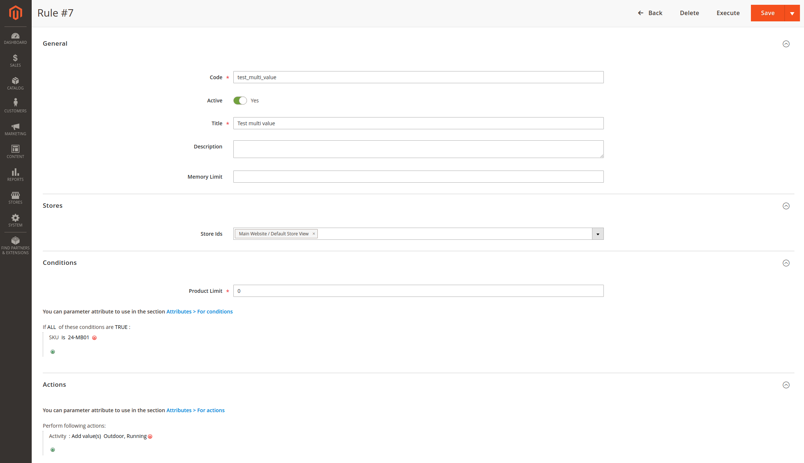

### Config
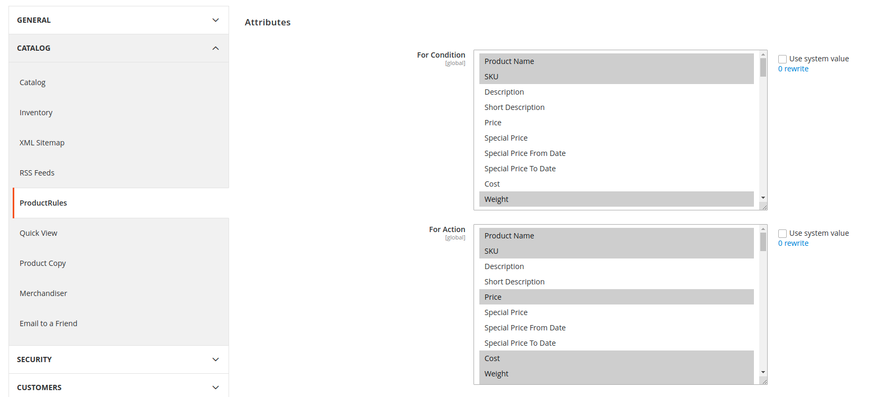
### les conditions
Il est possible d'empiler les conditions

#### Attributs produit
Conditions sur les attributs de Magento qui sont selectionnés dans la config du module en BO

#### Dans un website
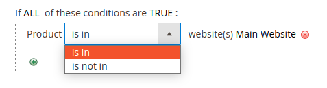

#### Nouveau
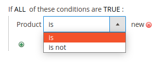

#### Créer depuis X heures/jours
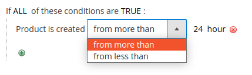
- champs 1 : un nombre pour le champs 2
- champs 2
  - heures
  - jours

#### A un prix promo
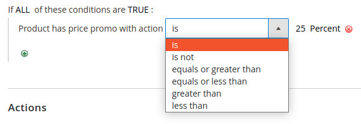
- champs 1 : un nombre pour le champs 2
- champs 2
  - percent
  - fixe
  
#### A une regle catalogue en cours
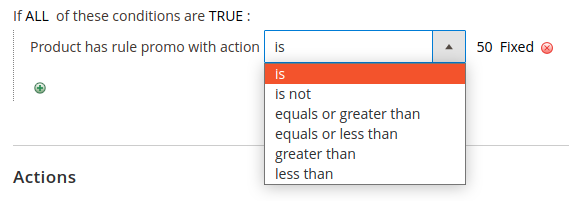
- champs 1 : un nombre pour le champs 2
- champs 2
  - percent
  - fixe
  
#### Meilleures ventes
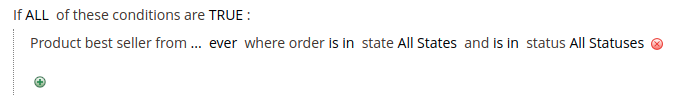
- champs 1 : un nombre pour le champs 2 (heures / jours)
- champs 2
  - de tous les temps
  - heures
  - jours
- champs 3 : pour le champs 4
  - est
  - n'est pas
- champs 4 : la liste des states
- champs 5 : pour le champs 6
    - est
    - n'est pas
- champs 6 : la liste des status

### les actions
Il est possible d'empiler les actions à effectuer sur la liste des produits trouvés par les conditions

#### ajouter à des catégories
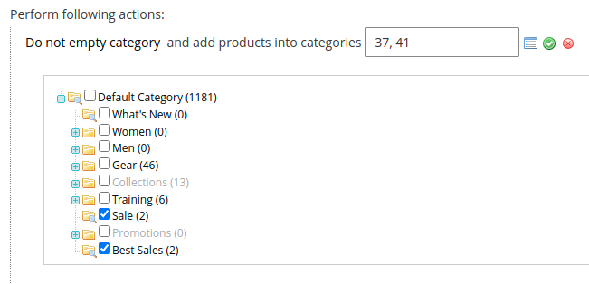
- champs 1
  - vide la catégorie
  - ne vide pas la catégorie

#### retirer des catégories
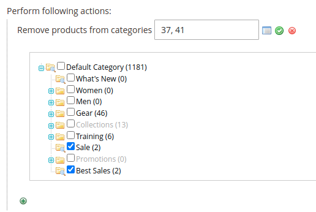

#### Affecter le numéro
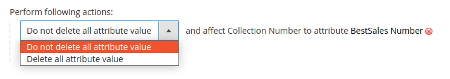
Cette action est à coupler avec la condition "Best seller" et permet de stocker dans un attribut du produit le nombre trouvé (ici le nombre de vente)
- champs 1
  - ne pas effacer les valeurs de cet attribut pour les autres produits
  - effacer les valeurs de cet attribut pour les autres produits

#### Affecter la position
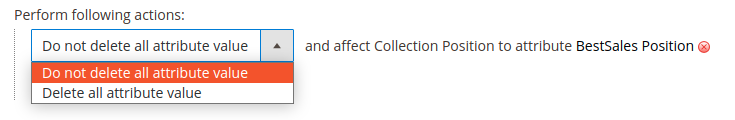
Cette action est à coupler avec la condition "Best seller" et permet de stocker dans un attribut du produit la position trouvée
- champs 1
    - ne pas effacer les valeurs de cet attribut pour les autres produits
    - effacer les valeurs de cet attribut pour les autres produits

#### modifier un attribut simple
affecter une valeur a un attribut du produit

### modifier un attribut de type multiple
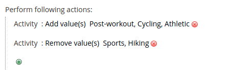
- champs 1
  - ajouter une ou plusieurs valeurs
  - retirer une ou plusieurs valeurs 